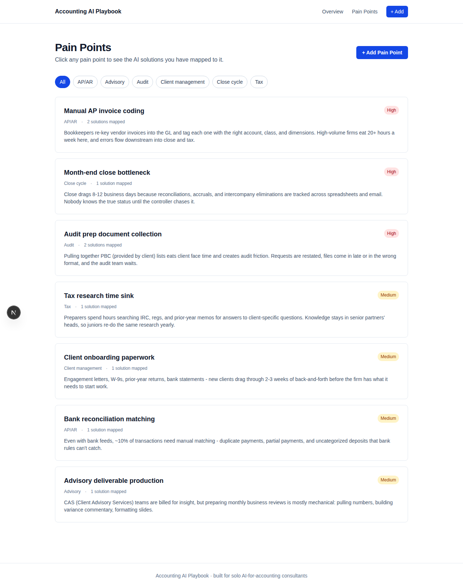
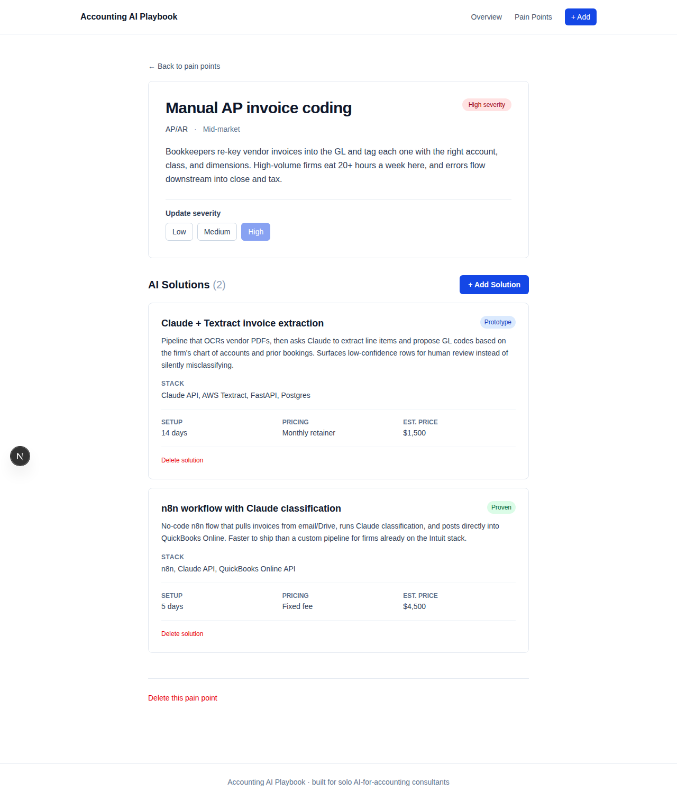

# Accounting AI Playbook

> Frontend for a catalog of recurring accounting pain points (close cycle, AP coding, audit prep) mapped to AI solutions you can actually offer — each with stack, maturity level, setup days, and a target price. Built so a solo AI-for-accounting consultant can show up to a prospect call with priced, tech-stacked answers instead of vapor.


Backend: [accounting-ai-playbook-api](https://github.com/Auth3nticAI/accounting-ai-playbook-api)

---



## What's here

- **Four pages** — Overview (stats), Pain Points list (filterable), Add Pain Point, Pain Point detail with nested solutions
- **One-to-many CRUD** — add pain points, attach AI solutions, update severity, delete either
- **Live category filter** — `useState`-backed buttons; the API takes a `?category=` query param
- Loading + error states on every fetching page, mobile-responsive throughout



## Stack

- Next.js 16 App Router + TypeScript
- Tailwind 4
- `NEXT_PUBLIC_API_URL` env var for the API base

## Run

```bash
# Backend running on :8000 first — see the accounting-ai-playbook-api repo

npm install
echo "NEXT_PUBLIC_API_URL=http://127.0.0.1:8000" > .env.local
npm run dev
```

Open http://localhost:3000.

## Project layout

```
.
├── app/
│   ├── layout.tsx                       # Shared nav + footer
│   ├── page.tsx                         # Overview (stats)
│   └── pain-points/
│       ├── page.tsx                     # List with category filter
│       ├── new/page.tsx                 # Add form
│       └── [id]/page.tsx                # Detail + nested solutions
└── lib/
    └── types.ts                         # Shared types
```

## Background

Built as Mini Project 2 for **CSE552 — Fullstack Software Development in the Age of AI Agents**.
